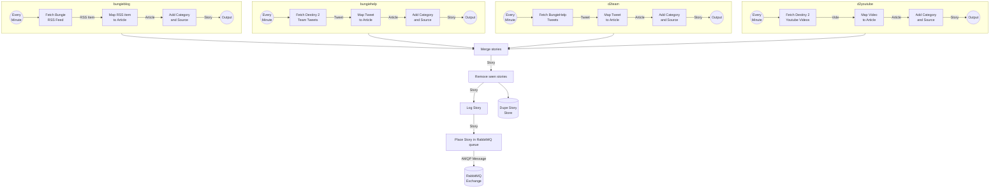

```mermaid
flowchart TD

subgraph bungieblog
A((Every \n Minute)) -->
B[Fetch Bungie \n RSS Feed] --RSS Item-->
C[Map RSS item \n to Article] --Article-->
D[Add Category \n and Source] --Story-->
E((Output))
end

bungieblog --> U

subgraph bungiehelp
F((Every \n Minute)) -->
G[Fetch Destiny 2 \n Team Tweets] --Tweet-->
H[Map Tweet \n to Article] --Article-->
I[Add Category \n and Source] --Story-->
J((Output))
end

bungiehelp --> U

subgraph d2team
K((Every \n Minute)) -->
L[Fetch BungieHelp \n Tweets] --Tweet-->
M[Map Tweet \n to Article] --Article-->
N[Add Category \n and Source] --Story-->
O((Output))
end

d2team --> U

subgraph d2youtube
P((Every\nMinute)) -->
Q[Fetch Destiny 2 \n Youtube Videos] --Video-->
R[Map Video \n to Article] --Article-->
S[Add Category \n and Source] --Story-->
T((Output))
end

d2youtube --> U

U[Merge stories] --Story-->
V[Remove seen stories] --Story-->
W[Log Story] --Story-->
X[Place Story in RabbitMQ queue] --AMQP Message-->
Y[(RabbitMQ \n Exchange)]

V --> Z[(Dupe Story \n Store)]

```